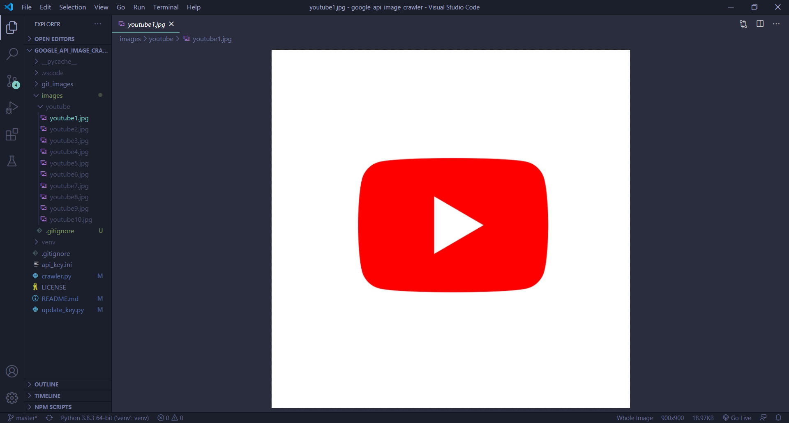

# google_api_image_crawler

Google image scraper with Google Search Engine API

 

## Description

---

 

Application used for scraping Images from google images after having searched a given phrase. 

This program uses google api, so before running it you must get your own using the link below. 

Get an API key here: [Custom Search JSON API](developers.google.com/custom-search/v1/introduction)

## Usage

---

 
Fistly run:  

        pip install google-api-python-client

After you had possesed the api_key from the Description section you should run:  

        python update_key.py {api_key}

That will update the api_key.ini config file and make the application usable. Next step is to simply run:  

        python crawler.py {searched_phrase}

If you would like to search a phrase consisting of several words use an uncderscore instead of a space.

Update:
Now you can also specify larger number of photos to download by adding a second argument like this (Note: number has to be divisible by 10):
  
   

        python crawler.py {searched_phrase} {number_of_photos}

## Example

---

After running  

        python crawler.py youtube

in directory images there has been created a new directory called youtube. In the screenshot you can see the tree of this project and the first picture that popped up after running this script.  

